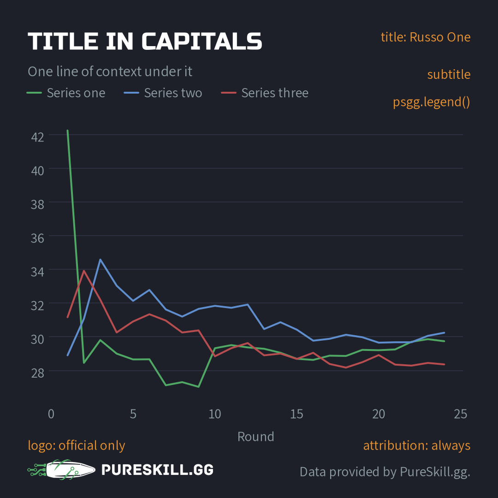

# PureSkill.gg Data Science Showcase

Make PureSkill.gg-style graphics from Counter-Strike 2 match data.

Clone this repo, point it at your data, and matplotlib plots in the house style: the PureSkill.gg colors, fonts and sizes, canvases sized for Instagram, TikTok, YouTube, X, slides and articles, map radars, and the attribution line on every image. Finished graphics go in the [gallery](gallery/).



## Quickstart

You need [Python 3.14](https://www.python.org/) and [uv](https://docs.astral.sh/uv/).

```sh
git clone https://github.com/pureskillgg/datascience-showcase.git
cd datascience-showcase
uv sync
make hooks               # the pre-commit checks
cp .env.example .env     # then point it at your data (see below)
```

```python
import pureskillgg_datascience_showcase as psgg

fig, ax = psgg.figure("Kills by weapon", "60 matches, 2026-08-01 to 08-07", preset="square")
ax.barh(["AK-47", "M4A1-S", "AWP"], [2927, 1414, 813])
psgg.save("out/kills.png")
```

Importing the package applies the style, so plain `plt.subplots()` code comes out branded too, and `psgg.save()` adds the attribution line to it.

## Get the data

The data is the PureSkill.gg Competitive CS2 Gameplay data set on the AWS Data Exchange. It's free to subscribe to, and moving it costs standard AWS fees. You export days of matches, download them into a folder, and build *tomes*: small tables made from many matches.

**[docs/getting-data.md](docs/getting-data.md)** walks through it. **[docs/data-primer.md](docs/data-primer.md)** explains what's in a match, and the traps to avoid when you plot it.

## Make graphics

| You want | Use |
| --- | --- |
| A branded canvas | `psgg.figure(title, subtitle, preset=..., theme="dark" \| "light")` |
| The legend under the subtitle | `psgg.legend(ax)` |
| The image, attributed | `psgg.save("out/name.png")` |
| Series colors, in their fixed order | the axes' color cycle, or `psgg.series_colors(n)` |
| T and CT colors | `psgg.side_color("T")`, `psgg.side_color("CT")` |
| A map radar, positions and heat | `psgg.maps.draw_radar`, `psgg.maps.to_radar`, `psgg.maps.heatmap`, `psgg.maps.label_sites` |
| A video | `psgg.save_animation(anim, "out/clip.mp4")` |

| Preset | Size | For |
| --- | --- | --- |
| `square` | 1080×1080 | Instagram feed, LinkedIn, Discord |
| `portrait` | 1080×1350 | Instagram feed, Reddit on phones |
| `vertical` | 1080×1920 | Stories, reels, TikTok, YouTube Shorts |
| `wide` | 1920×1080 | YouTube, slides, X, Reddit, Discord |
| `link` | 1200×630 | Link previews |
| `article` | 1200 wide, rendered at 2× | Docs and blog posts |

`scale=2` renders any preset at double resolution and looks the same. The **[style guide](docs/style.md)** has the colors, type and layout rules.

`templates/gallery-item/` is a complete example to copy: a script, a notebook and a README.

## Attribution and the logo

The data license requires **"Data provided by PureSkill.gg."** on anything you publish. `psgg.save()` puts it on every image.

`official=True` adds the PureSkill.gg logo. **Only PureSkill.gg's own graphics are official.** If you didn't make it as PureSkill.gg, don't mark it official, and don't add the logo any other way.

## With a coding agent

[AGENTS.md](AGENTS.md) tells coding agents how to work here, and [.agents/skills/make-graphic/](.agents/skills/make-graphic/SKILL.md) is the step-by-step for making a graphic, including looking at the result before calling it done.

## Contributing

Add your graphics to the gallery by pull request; see [CONTRIBUTING.md](CONTRIBUTING.md). `make test`, `make lint` and `make check` run what CI runs.

## License

- **Code:** the [MIT license](LICENSE.txt). It covers the code, not the PureSkill.gg name or logo.
- **Fonts:** [Russo One](pureskillgg_datascience_showcase/fonts/OFL-RussoOne.txt) and [Assistant](pureskillgg_datascience_showcase/fonts/OFL-Assistant.txt), under the SIL Open Font License.
- **Radars:** the map images are Valve's, from Counter-Strike 2's game files.
- **Data:** you get it under the data set's Data Subscriber Agreement, [CC BY-NC-SA 4.0](https://creativecommons.org/licenses/by-nc-sa/4.0/) in short. Graphics made from it carry the same license. See [docs.pureskill.gg](https://docs.pureskill.gg/datascience/).
