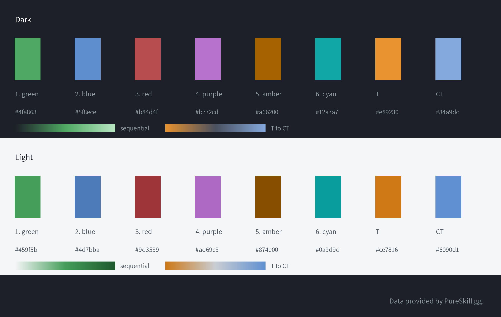

# Style guide

What a PureSkill.gg graphic looks like, and the rules the kit follows so you don't have to remember them. Importing `pureskillgg_datascience_showcase` applies all of it; `psgg.figure()`, `psgg.legend()` and `psgg.save()` do the layout.

## Layout

- **Title** at the top left, in Russo One, in capitals. Keep it short: it shrinks to fit, then wraps.
- **Subtitle** under it, one line of context: how many matches, which dates, what the colors mean.
- **Legend** under the subtitle (`psgg.legend(ax)`). Every chart with two or more series has one; a single series is named by the title.
- **Attribution** at the bottom right, always: "Data provided by PureSkill.gg." The data license requires it. `psgg.save()` adds it to any figure.
- **Logo** at the bottom left, **only on PureSkill.gg's own graphics** (`official=True`). If you aren't PureSkill.gg, never mark a graphic official, and don't add the logo any other way.
- Faint horizontal grid lines, no axis lines, no tick marks.

## Colors

- **Dark is the default** (the webapp's background, `#1e2029`). Light (`#f5f6f8`) is for print and for pages with a white background: `theme="light"`.
- **Series colors come in a fixed order:** green, blue, red, purple, amber, cyan. The kit assigns them in that order. Don't reorder them or pick your own: the order is what keeps neighbors apart for color-blind readers. The palette was checked with a color-vision simulation: the closest neighbors differ by ΔE 17.5 on dark and 18.4 on light, and 8 is the target.
- **At most six series.** Fold the rest into "Other", or split the chart. `psgg.series_colors(7)` refuses.
- **Scatter plots take at most three groups**, since any two dots can sit side by side. The first three colors stay apart in every pairing.
- **T is amber and CT is blue**, on every chart that splits by side (`psgg.side_color("T")`). Don't use them for anything else.
- **Magnitude:** one hue, `psgg_green_dark` or `psgg_green_light` (the default colormap). **T against CT:** `psgg_sides_dark` or `psgg_sides_light`, amber through grey to blue. **Heat on a map:** `psgg_heat`, transparent to green to sand.
- Text stays in the ink colors (grey and white on dark). Never color text with a series color.

## Type and sizes

- **Russo One** for titles, **Assistant** for everything else. Both ship with the kit under the Open Font License.
- **Pick a preset for where the image goes:**

  | Preset | Size | Body text | For |
  | --- | --- | --- | --- |
  | `square` | 1080×1080 | 30 px | Instagram feed, LinkedIn, Discord |
  | `portrait` | 1080×1350 | 30 px | Instagram feed, Reddit on phones |
  | `vertical` | 1080×1920 | 32 px | Stories, reels, TikTok, YouTube Shorts |
  | `wide` | 1920×1080 | 32 px | YouTube, slides, X, Reddit, Discord |
  | `link` | 1200×630 | 28 px | Link previews |
  | `article` | 1200 wide, rendered at 2× | 18 px | Docs and blog posts |

- **Nothing under 30 px on the 1080 social presets.** A 1080-pixel image shows about 390 pixels wide on a phone, so smaller text can't be read there. Article images floor at 16 px.
- **Higher resolution:** `scale=2` (or more) multiplies every size, so a 4K render looks the same as the 1080 one.

## Maps

- `psgg.maps.draw_radar(ax, "de_mirage")` draws the stock radar, dimmed to 55% so the data leads, and cropped to the map.
- `psgg.maps.to_radar()` converts world positions, `psgg.maps.heatmap()` adds heat, and `psgg.maps.label_sites()` writes A, B and the spawns.
- Two-floor maps need a separate image or panel per floor. See the [field notes](data-primer.md#positions-and-maps).

## Animations

`psgg.save_animation(anim, "out/clip.mp4")` renders a matplotlib animation at the preset's size, with the attribution. Use `vertical` for TikTok and Shorts and `wide` for YouTube. Videos don't go in git: post them, and put a still frame (`psgg.save()`) and the link in the gallery.

## Before you publish

- Look at the rendered image at the size people will see it, not only in a notebook.
- Check that no labels overlap, that the text is readable on a phone, and that the attribution is there.
- The title and subtitle say what the chart shows and where the data came from (matches, dates).
